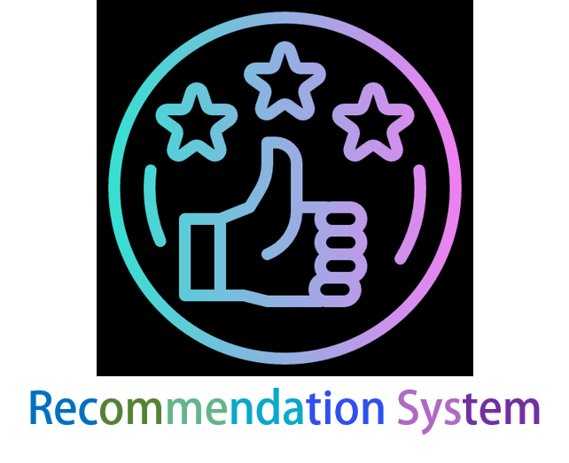

# Recommendation System

    

Recommendation System has a goal to review representative papers from basic to current research trends.

> Personal Goal
* Review RecSys papers at least once a week
* Study core concpet and upload it on [my blog](https://blossominkyung.com/).
* Upload a review link on here.
* To implement some papers following the flow from basic to trends on [Tutorial reposit](https://github.com/blossominkyung/awesome-recsys-tutorial).

> Whole review is by Korean.

## Review lists

### The YouTube Video Recommendation System 
**Author** James Davidson et al

**Publish** [RecSys'10](https://www.inf.unibz.it/~ricci/ISR/papers/p293-davidson.pdf?fbclid=IwAR02saeLLv279WAJy5y5Y1SNLNv91t56vXKWzVpToXZqbQsN-_200f7Zd2g)

**Review** [The YouTube Video RecSys](https://blossominkyung.com/250186a5-9a8d-4b05-bf6c-bb59ef7d334d)

---

### Deep Neural Networks for YouTube Recommendations
**Author** Paul Covington et al

**Publish** [RecSys'16](https://static.googleusercontent.com/media/research.google.com/ko//pubs/archive/45530.pdf?fbclid=IwAR3cUcBD5z7a1a97SQAO9akIykyugO_jfMHKGzw_BuezPUSmLBTXFKZxDCQ)

**Review** [DNN for YouTube](https://blossominkyung.com/4834a9c0-091d-423a-995e-2f8dfc1dc702)

---

### Matrix Factorization Techniques for Recommender Systems

**Author** Yehuda Koren et al

**Publish** [Computer Society'09](https://datajobs.com/data-science-repo/Recommender-Systems-%5BNetflix%5D.pdf)

**Review** [Matrix Factorization: Netflix](https://blossominkyung.com/47ebfb7d-efce-47ec-97b4-1540c13b26b3)

---

### Wide & Deep Learning for Recommender Systems

**Author** Google Inc.

**Publish** [DLRS'16](https://arxiv.org/pdf/1606.07792.pdf)

**Review** [Wide & Deep Model](https://blossominkyung.com/01594455-9327-4393-9c85-ba5c6f16698d)

---

### DeepFM: A Factorization-Machine based Neural Network for CTR Prediction
**Author** Huifeng Guo et al

**Publish** [IJCAI'17](https://arxiv.org/pdf/1703.04247.pdf)

**Review** [DeepFM for CTR Prediction](https://blossominkyung.com/1e717a30-653a-4c0a-bb89-8800e9183798)

---

### Recommending What Video to Watch Next: A Multitask Ranking System
**Author** Zhe Zhao et al 

**Publish** [RecSys'19](https://daiwk.github.io/assets/youtube-multitask.pdf?fbclid=IwAR3z4b9YlBP_99_AshH8alFT6YerXKcAdgKv5d438YnWQefk7yXwNpRrmJY)

**Review** [What Video to Watch Next?](https://blossominkyung.com/b621c61f-7def-472e-abed-452b51cb35d7)

---

